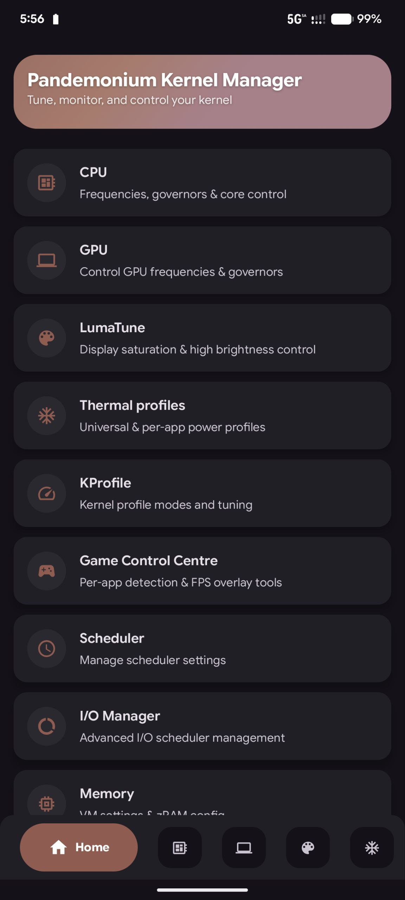

# Pandemonium Kernel Manager

  

A root-first Android performance toolkit for kernel tuning, game optimization, backup/restore, flashing workflows, thermal/powerhint editing, and system diagnostics.

## 📱 Preview

  

## ✨ Features

### Core Kernel Controls
- CPU management (governors, min/max frequencies, per-cluster controls)
- GPU controls and monitoring
- I/O scheduler tuning
- Live monitoring for CPU/GPU/RAM/thermal metrics
- Profiles and per-app performance tuning

### Game Control Center
- Per-game app list with automation
- In-game floating overlay with compact/full display modes
- Configurable overlay metrics (FPS, frametime, CPU, GPU, RAM, temps, clocks)
- Overlay customization panel and quick controls
- Monster Mode with baseline/restore behavior
- FPS method selection:
  - New API (`ITaskFpsCallback`) path
  - Legacy sysfs fallback path

### FPS Recording & Session Analytics
- Start/stop in-game recording from overlay tools
- Session history list per app
- Detailed per-session summary metrics (max/min/avg FPS, lows, variance, temps, power)
- Multi-graph timeline analytics (FPS, frametime, CPU/GPU/RAM/battery related metrics)
- Save/share session graphics

### Power Insight (Battery)
- Persistent battery monitoring service + notification
- History and analytics graphs
- Current/idle/active usage stats
- Session-aware battery usage tracking
- Configurable refresh/settings and reset behaviors

### Tools Suite
- Kernel Flasher
- Recovery ZIP Flasher
- Payload Extractor
- Script Manager
- Build.prop Editor
- LogWolf (logs/crash tooling)
- Process Manager
- App Freezer
- Data Backup & Restore
- Dexopt Optimization
- ADB/Fastboot Manager (device-side tooling)

### Advanced Editors
- Mi Thermal Editor
  - Browse/edit/inject thermal configs
  - Saved/import/export/share flows
  - Backup before inject
- Powerhint Editor
  - JSON editing, validation, backup, import/export/share
  - Safe inject + reboot flow
- PKM Code Editor integration for file editing workflows

## 📋 Requirements

- Root access (required for most advanced features)
- Android 14+ (targeted modern builds)
- Device/kernel support for selected controls (varies by ROM/kernel)

## 🔧 Technical Details

- Built with Jetpack Compose
- Material 3 Design
- Root shell implementation for system file access
- Real-time monitoring with coroutines and background services
- Hidden API + fallback architecture for FPS collection
- Integrated tooling for flashing, backup, diagnostics, and editors

## 📲 Installation

1. Download the latest release
2. Install the APK
3. Grant root permissions when prompted
4. Access through app drawer or Quick Settings tile

## 🧩 Notes

- Some features are device/ROM dependent (sysfs nodes, thermal/powerhint paths, vendor behavior).
- On major ROM updates, reinstalling can help refresh internal tool staging.
- Always create backups before flashing or editing low-level configs.

## 🔒 Permissions

- ROOT access
- Quick Settings modification
- System settings modification

## 🤝 Contributing

Contributions are welcome! Please read our contributing guidelines before submitting pull requests.

## Resources
- [Releases](https://github.com/kenway214/pandemonium-kernel-manager-updater/releases)
- [Issues](https://github.com/kenway214/pandemonium-kernel-manager-updater/issues)

## Community

    

## ⚠️ Disclaimer

This application requires root access and should be used with caution. Incorrect settings may affect device stability.
